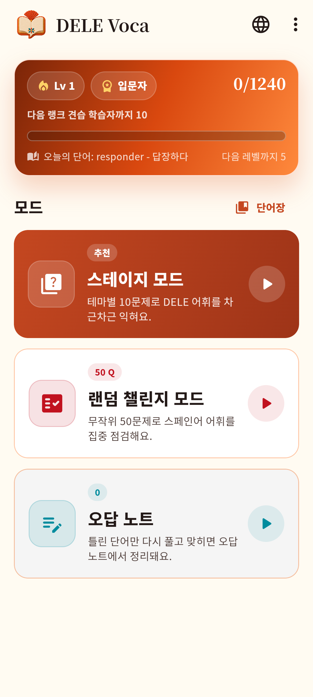
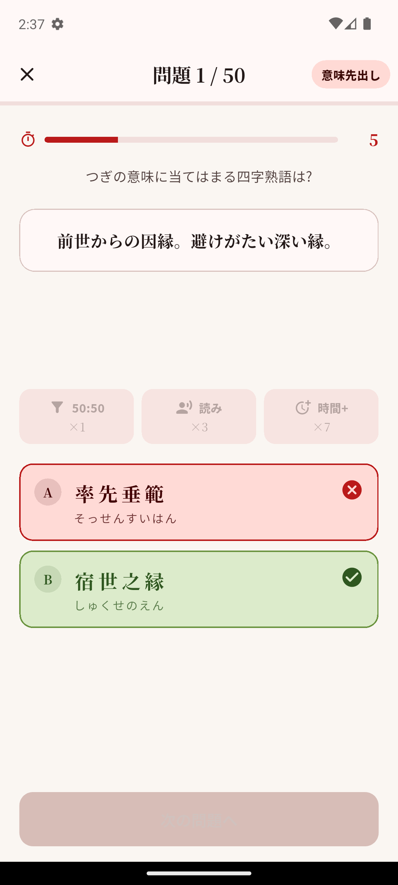
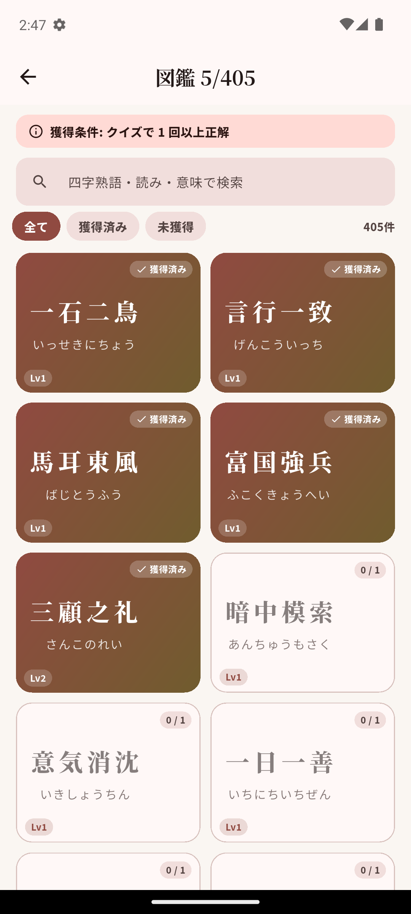
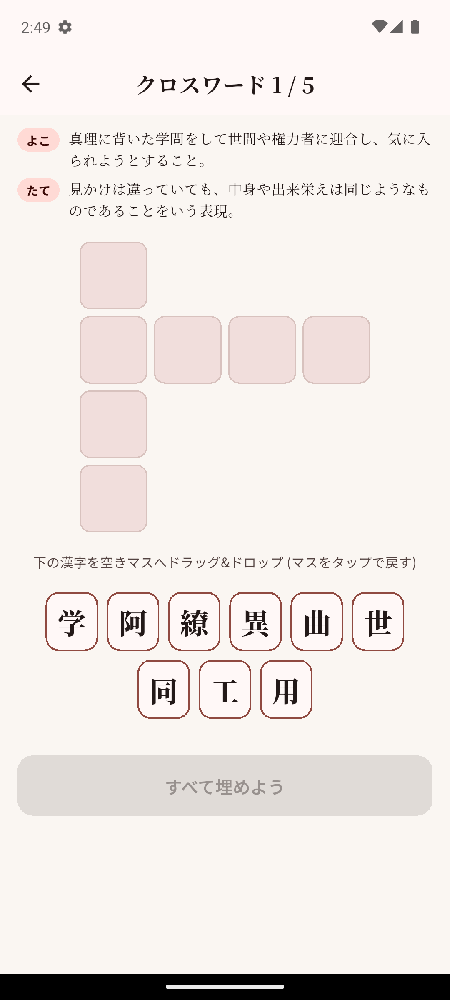

# 四字熟語道場 (Yojijukugo Dojo)

<p align="center">
  
</p>

<p align="center">
  <b>400問の四字熟語を段位制で鍛える、和モダンな学習クイズアプリ。</b><br/>
  Flutter / Material 3 / Noto Sans JP・Serif JP
</p>

<p align="center">
  
</p>

---

## 概要

中学生レベルの定番から漢検準1級・1級相当まで **400問以上** の四字熟語を収録。
5ステージ×8ラウンドの段位制クイズ、50問マラソンの「道場破り」、漢字共有クロスワードの 3 モードで、意味・読み・漢字を多角的に定着させます。

完全オフライン・外部通信なし・ユーザーデータはローカルのみ保存。

## 主な機能

- **ステージモード** — 5ステージ × 8ラウンド × 10問 = 400問の4択クイズ。星評価でアンロック
- **道場破り** — ランダム50問のマラソン。正解率で推定パーセンタイルを算出
- **クロスワード** — 1漢字を共有する2つの熟語を4×4盤で完成させるパズル。ドラッグ&ドロップ操作
- **図鑑** — 全熟語一覧。正解でアンロックされ、意味・読み・イラスト (一部) を閲覧
- **4種類の出題形式** — ふつう / 穴埋め / 読みなし / 意味先出し。1問ごとにランダム切替
- **段位 & レベル** — 白帯→名人まで。5正解ごとに Lv+1、昇段・レベルアップ時に紙吹雪演出
- **本日の四字熟語** — 日替わりで 1 語ピックアップ、時間帯挨拶付き
- **ヒントシステム** — 50:50 / 読み表示 / 時間+。正解ドロップで入手
- **BGM & SFX** — クイズ BGM ループ、正解・クリア・パーフェクト等の効果音

## スクリーンショット

| ホーム | クイズ | 図鑑 | クロスワード |
|---|---|---|---|
|  |  |  |  |

## 技術スタック

| 領域 | 採用技術 |
|---|---|
| フレームワーク | Flutter 3.38 系 / Dart SDK `^3.10.4` |
| UI | Material 3 (`useMaterial3: true`) |
| 永続化 | `shared_preferences` |
| 音声 | `audioplayers` |
| アニメ | `flutter_animate` / `confetti` |
| 広告 | `google_mobile_ads` (初回リリースは OFF) |
| 外部リンク | `url_launcher` |
| フォント | Noto Sans JP / Noto Serif JP (同梱) |

## セットアップ

```bash
git clone https://github.com/JunhwiAhn/idioms_quiz.git
cd idioms_quiz
flutter pub get
flutter run -d <device_id>
```

### リリースビルド

```bash
flutter build appbundle --release
# → build/app/outputs/bundle/release/app-release.aab
```

署名設定は `android/key.properties` (gitignored) を参照。`android/app/build.gradle.kts` が自動で読み込みます。

## プロジェクト構成

```
lib/
├── main.dart                 — エントリ + グローバルエラーハンドラ
├── theme/app_theme.dart      — Material 3 テーマ・フォントヘルパ
├── models/idiom.dart         — Idiom モデル
├── data/
│   ├── ad_service*.dart      — AdMob (条件付きエクスポート: web=stub / mobile=実装)
│   ├── audio_service.dart    — BGM / SFX 再生
│   ├── crossword.dart        — 漢字共有ペアと 4×4 盤生成
│   ├── daily.dart            — 日替わり熟語・挨拶
│   ├── idiom_images.dart     — アセット画像レジストリ
│   ├── idiom_repository.dart — idioms.json ロード
│   ├── kanken_tier.dart      — 漢検相当レベル推定
│   ├── level_tier.dart       — レベル→帯色
│   ├── quiz_session.dart     — 出題生成・採点
│   ├── rank.dart             — 段位 (白帯〜名人)
│   ├── score_service.dart    — 進捗永続化・ヒント付与
│   └── stage_plan.dart       — 5×8×10 配分 / 星計算
└── screens/
    ├── splash_screen.dart    — スプラッシュ
    ├── home_screen.dart      — トップランチャー
    ├── stage_screen.dart     — ステージ一覧
    ├── round_screen.dart     — ラウンド一覧
    ├── quiz_screen.dart      — クイズ本体
    ├── result_screen.dart    — リザルト
    ├── collection_screen.dart— 図鑑 (検索+フィルタ)
    └── crossword_screen.dart — クロスワード
```

## データ管理

- 問題データ: `assets/data/idioms.json` — `{idiom, reading, meaning, wrongChoices, difficulty}` の配列
- 画像: `assets/images/*.webp` — ファイル名が 四字熟語と一致する場合に自動で表示
- フォント: `assets/fonts/NotoSansJP-*.ttf` / `NotoSerifJP-*.ttf` (同梱・オフライン)
- ユーザー進捗: `SharedPreferences` (端末ローカルのみ、外部送信なし)

## プライバシー

- 外部サーバーへのデータ送信なし
- トラッキング SDK 未搭載
- 詳細: [プライバシーポリシー](docs/privacy_policy.md)

## ライセンス / 著作権

**© 2026 Junhwi Ahn. All rights reserved.**

本リポジトリ (ソースコード・デザイン・アセット・データ・ドキュメント等) は Junhwi Ahn が所有するプロプライエタリ (所有権保留) 作品です。詳細は [LICENSE](LICENSE) を参照。

- 本リポジトリを閲覧することは、複製・改変・再配布・商用利用の権利を付与するものではありません
- アプリのリパッケージ公開 (Google Play Store / App Store 等) は禁止
- 個人学習・教育目的での閲覧は許可

第三者アセット (Noto フォント、依存パッケージ等) はそれぞれ元のライセンスに従います: [NOTICE.md](NOTICE.md) 参照。OSS 依存パッケージのライセンスはアプリ内「ライセンス」メニュー (Flutter 標準 `showLicensePage`) からも閲覧可能。

## 開発ドキュメント

- [仕様書 / メンテナンスガイド](../../../../Desktop/四字熟語道場_仕様書.md) (ローカル)
- [Play Console 提出用テキストパック](docs/play_console_pack.md)
- [Play ストア掲載用アセット](docs/play_assets/)
